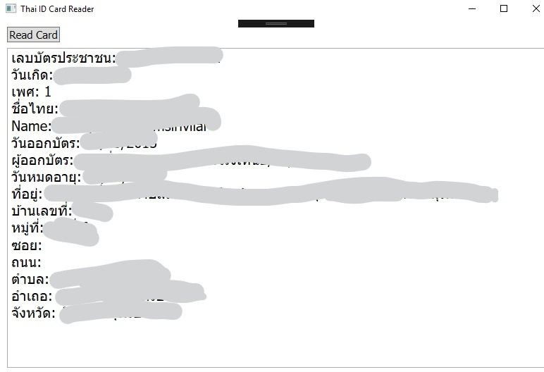

# ThaiIDCardReader
Sample app for reading thai ID card. [Download](https://github.com/piyapan039285/ThaiIDCardReader/releases)  
**Credit**: [ThaiNationalIDCard](https://github.com/chakphanu/ThaiNationalIDCard).    

# Requirements
 * Windows >= 7 SP1
 * Visual Studio >= 2015
 * .NET Framework 4.5

# Setup Project for Development
 1. Make sure that card reader device is plugged-in and driver is installed.
    * If you use smart card reader version SCR-XXX. You can download from [Driver](https://github.com/piyapan039285/ThaiIDCardReader/tree/master/Drivers) folder. I keep file in this repo because it is my test device.
 1. Open ThaiIDCardReader.sln in Visual Studio. 
 1. Build and run project.

# Screenshot
